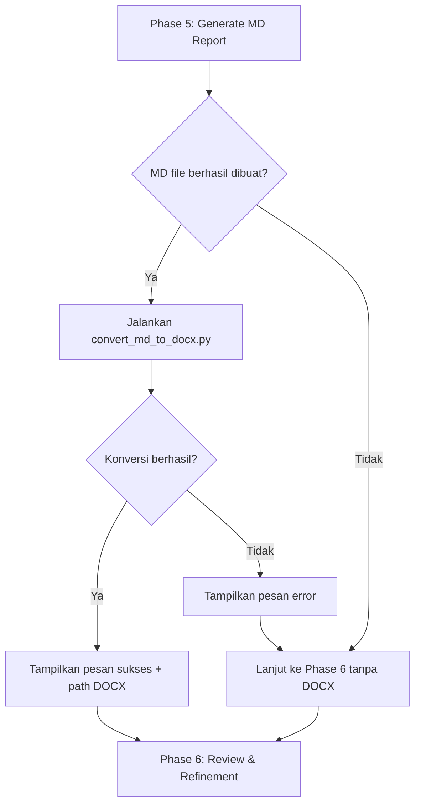
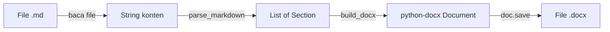

# Dokumen Desain: SOW Analysis DOCX Conversion

## Ikhtisar

Fitur ini menambahkan skrip konverter Python (`convert_md_to_docx.py`) ke dalam skill `cloud-sow-analyzer` yang secara otomatis mengubah laporan analisis Markdown menjadi dokumen Word (.docx). Konverter dijalankan sebagai langkah baru antara Phase 5 (Generate Markdown Report) dan Phase 6 (Review & Refinement) dalam workflow SOW Analyzer.

Pendekatan yang dipilih adalah skrip Python mandiri menggunakan library `python-docx`, karena:
- Skill `cloud-sow-analyzer` sudah berbasis Python (menggunakan `python-docx` untuk membaca SOW)
- Library `python-docx` sudah tercantum sebagai optional dependency di `metadata.json`
- Skrip Python lebih mudah dijalankan secara independen untuk konversi manual
- Referensi dari `skills/docx/` dan `skills/aws-technical-doc-generator/` menunjukkan pola yang sudah terbukti

## Arsitektur

### Diagram Alur Konversi



### Posisi dalam Workflow


Konversi DOCX disisipkan sebagai sub-langkah Phase 5B. Jika gagal, workflow tetap lanjut ke Phase 6.

## Komponen dan Antarmuka

### 1. `convert_md_to_docx.py` (Skrip Utama)

Lokasi: `skills/cloud-sow-analyzer/scripts/convert_md_to_docx.py`


**Antarmuka CLI:**
```bash
python scripts/convert_md_to_docx.py <input_md_file> [--output <output_docx_file>]
```

**Fungsi Utama:**

| Fungsi | Deskripsi | Input | Output |
|--------|-----------|-------|--------|
| `main(args)` | Entry point CLI, parsing argumen | `sys.argv` | Exit code (0=sukses, 1=error) |
| `convert_md_to_docx(md_path, docx_path)` | Fungsi utama konversi | Path MD, Path DOCX (opsional) | Path DOCX yang dihasilkan |
| `parse_markdown(content)` | Parsing konten MD menjadi struktur data | String konten MD | List of `Section` objects |
| `build_docx(sections, title)` | Membangun dokumen DOCX dari sections | List sections, judul | `Document` object (python-docx) |

### 2. Modul Parser Markdown

Bertanggung jawab mem-parsing konten Markdown menjadi struktur data intermediate yang bisa diproses oleh builder DOCX.

**Elemen yang di-parse:**

| Elemen MD | Representasi Internal |
|-----------|----------------------|
| `# Heading 1` | `Section(level=1, text="...")` |
| `## Heading 2` | `Section(level=2, text="...")` |
| `### Heading 3` | `Section(level=3, text="...")` |
| `\| col1 \| col2 \|` | `Table(headers=[...], rows=[[...]])` |
| `- item` | `BulletItem(text="...", level=0)` |
| `- [ ] item` | `ChecklistItem(text="...", checked=False)` |
| `- [x] item` | `ChecklistItem(text="...", checked=True)` |
| `` ```code``` `` | `CodeBlock(content="...")` |
| `**bold**` | `TextRun(text="...", bold=True)` |
| `*italic*` | `TextRun(text="...", italic=True)` |
| Teks biasa | `Paragraph(runs=[TextRun(...)])` |
| `🔴🟠🟡🟢` | `TextRun(text="emoji", is_risk_indicator=True)` |

### 3. Modul DOCX Builder

Menggunakan `python-docx` untuk membangun dokumen Word dari struktur data intermediate.

**Konfigurasi Dokumen:**
- Ukuran halaman: US Letter (8.5" × 11") atau A4
- Margin: 1 inci di semua sisi
- Font default: Arial, 11pt
- Header: Judul dokumen (rata kanan)
- Footer: Nomor halaman (rata tengah)

**Mapping Style:**

| Elemen | Style DOCX |
|--------|-----------|
| H1 | Heading 1 (16pt, bold) |
| H2 | Heading 2 (14pt, bold) |
| H3 | Heading 3 (12pt, bold) |
| Tabel header | Background biru (#4472C4), teks putih, bold |
| Tabel baris genap | Background putih |
| Tabel baris ganjil | Background abu-abu (#F2F2F2) |
| Code block | Font Courier New, 9pt, background #F5F5F5 |
| Checklist unchecked | Prefix "☐ " |
| Checklist checked | Prefix "☑ " |
| Risk emoji 🔴 | Teks "🔴" atau fallback teks merah "[CRITICAL]" |
| Risk emoji 🟠 | Teks "🟠" atau fallback teks oranye "[HIGH]" |
| Risk emoji 🟡 | Teks "🟡" atau fallback teks kuning "[MEDIUM]" |
| Risk emoji 🟢 | Teks "🟢" atau fallback teks hijau "[LOW]" |

## Model Data

### Struktur Data Intermediate

```python
from dataclasses import dataclass, field
from typing import List, Union, Optional

@dataclass
class TextRun:
    text: str
    bold: bool = False
    italic: bool = False
    is_risk_indicator: bool = False
    font_name: Optional[str] = None
    font_size: Optional[int] = None
    color: Optional[str] = None

@dataclass
class Paragraph:
    runs: List[TextRun] = field(default_factory=list)

@dataclass
class BulletItem:
    runs: List[TextRun] = field(default_factory=list)
    level: int = 0

@dataclass
class ChecklistItem:
    runs: List[TextRun] = field(default_factory=list)
    checked: bool = False

@dataclass
class CodeBlock:
    content: str = ""

@dataclass
class Table:
    headers: List[str] = field(default_factory=list)
    rows: List[List[str]] = field(default_factory=list)

@dataclass
class Section:
    level: int = 1  # 1=H1, 2=H2, 3=H3
    text: str = ""
    children: List[Union[Paragraph, BulletItem, ChecklistItem, CodeBlock, Table, 'Section']] = field(default_factory=list)
```

### Alur Data



### Dependency

| Library | Versi Min | Kegunaan |
|---------|-----------|----------|
| `python-docx` | 0.8.11 | Pembuatan file DOCX |
| Python | 3.8+ | Runtime |

Tidak ada dependency tambahan selain `python-docx`. Library ini sudah tercantum di `metadata.json` sebagai optional dependency.


## Correctness Properties

*Sebuah property adalah karakteristik atau perilaku yang harus berlaku di semua eksekusi valid dari sebuah sistem — pada dasarnya, pernyataan formal tentang apa yang seharusnya dilakukan sistem. Property berfungsi sebagai jembatan antara spesifikasi yang dapat dibaca manusia dan jaminan kebenaran yang dapat diverifikasi mesin.*

### Property 1: Derivasi Path Output

*For any* file Markdown dengan path valid, path output DOCX yang dihasilkan harus berada di direktori yang sama dengan file input dan memiliki nama file yang sama dengan ekstensi `.docx` menggantikan `.md`.

**Validates: Requirements 1.2, 1.3**

### Property 2: Round-Trip Fidelitas Konten

*For any* file Laporan_Analisis Markdown yang valid, semua teks, data tabel, dan item daftar yang ada dalam file MD harus dapat ditemukan dalam Dokumen_DOCX yang dihasilkan tanpa ada konten yang hilang.

**Validates: Requirements 7.1**

### Property 3: Preservasi Urutan Section

*For any* file Markdown dengan beberapa section (heading), urutan kemunculan section dalam Dokumen_DOCX harus sama persis dengan urutan dalam file Markdown sumber.

**Validates: Requirements 7.2**

### Property 4: Pemetaan Hierarki Heading

*For any* file Markdown yang mengandung heading level 1, 2, dan 3, setiap heading harus dipetakan ke heading Word dengan level hierarki yang sesuai (H1→Heading 1, H2→Heading 2, H3→Heading 3).

**Validates: Requirements 2.1**

### Property 5: Konversi Tabel dengan Fidelitas Data

*For any* tabel Markdown dengan header dan baris data, Dokumen_DOCX yang dihasilkan harus mengandung tabel Word dengan jumlah kolom dan baris yang sama, serta seluruh data sel yang identik.

**Validates: Requirements 2.2, 7.3**

### Property 6: Preservasi Emoji Indikator Risiko

*For any* konten Markdown yang mengandung emoji indikator risiko (🔴, 🟠, 🟡, 🟢), Dokumen_DOCX yang dihasilkan harus mengandung representasi yang setara untuk setiap emoji tersebut (baik emoji asli maupun teks berwarna pengganti).

**Validates: Requirements 3.1**

### Property 7: Preservasi Formatting Inline dan List

*For any* konten Markdown yang mengandung teks bold, italic, bullet list, atau checklist, Dokumen_DOCX yang dihasilkan harus mempertahankan formatting bold/italic pada teks yang sesuai, mengonversi bullet list menjadi list Word, dan mengonversi checklist menjadi representasi visual (☐/☑).

**Validates: Requirements 2.3, 3.2, 3.4**

### Property 8: Formatting Code Block

*For any* konten Markdown yang mengandung code block (dibatasi oleh triple backtick), Dokumen_DOCX yang dihasilkan harus mengandung paragraf dengan font monospace yang memuat konten code block tersebut.

**Validates: Requirements 3.3**

### Property 9: Kegagalan Non-Destruktif

*For any* skenario di mana konversi gagal (file corrupt, error parsing, dll), file Markdown sumber harus tetap tidak berubah dan fungsi konversi harus mengembalikan error code tanpa melempar exception yang tidak tertangani.

**Validates: Requirements 4.3, 4.4**

## Penanganan Error

### Strategi Error Handling

Konverter menggunakan pendekatan "fail gracefully" — error pada konversi DOCX tidak boleh menghentikan workflow utama SOW Analyzer.

### Kategori Error dan Penanganan

| Kategori Error | Penyebab | Penanganan | Pesan ke User |
|---------------|----------|------------|---------------|
| File tidak ditemukan | Path MD salah/file dihapus | Return error code, log pesan | `❌ Error: File tidak ditemukan: {path}` |
| Dependency missing | `python-docx` tidak terinstal | Cek import di awal, tampilkan instruksi | `❌ Error: python-docx belum terinstal. Jalankan: pip install python-docx` |
| Parse error | MD format tidak valid/corrupt | Tangkap exception, return error | `⚠️ Warning: Gagal mem-parse file MD. DOCX tidak dibuat.` |
| Write error | Permission denied/disk penuh | Tangkap IOError, return error | `❌ Error: Gagal menulis file DOCX: {detail}` |
| Unexpected error | Bug atau kondisi tak terduga | Tangkap Exception umum, log traceback | `⚠️ Warning: Konversi DOCX gagal. Laporan MD tetap tersedia.` |

### Pola Implementasi Error Handling

```python
def convert_md_to_docx(md_path: str, docx_path: str = None) -> tuple[bool, str]:
    """
    Returns:
        (success: bool, message: str)
    """
    try:
        import docx
    except ImportError:
        return False, "python-docx belum terinstal. Jalankan: pip install python-docx"

    md_file = Path(md_path)
    if not md_file.exists():
        return False, f"File tidak ditemukan: {md_path}"

    if docx_path is None:
        docx_path = str(md_file.with_suffix('.docx'))

    try:
        content = md_file.read_text(encoding='utf-8')
        sections = parse_markdown(content)
        title = sections[0].text if sections else "SOW Analysis Report"
        doc = build_docx(sections, title)
        doc.save(docx_path)
        return True, f"✅ Dokumen DOCX berhasil dibuat: {docx_path}"
    except Exception as e:
        return False, f"Konversi DOCX gagal: {str(e)}"
```

### Integrasi dengan Workflow

Dalam SKILL.md, setelah Phase 5 generate report:

```python
# Di dalam workflow SOW Analyzer
md_report_path = "analysis-report.md"
# ... generate MD report ...

# Phase 5B: Convert to DOCX
success, message = convert_md_to_docx(md_report_path)
print(message)
# Workflow lanjut ke Phase 6 regardless of success/failure
```

## Strategi Pengujian

### Pendekatan Dual Testing

Pengujian menggunakan kombinasi unit test dan property-based test untuk cakupan komprehensif.

### Library yang Digunakan

| Library | Kegunaan |
|---------|----------|
| `pytest` | Framework unit test |
| `hypothesis` | Property-based testing |
| `python-docx` | Verifikasi output DOCX |

### Property-Based Tests

Setiap property test harus:
- Menjalankan minimal 100 iterasi (konfigurasi `@settings(max_examples=100)`)
- Mereferensikan property dari dokumen desain
- Menggunakan tag format: **Feature: sow-analysis-docx-conversion, Property {number}: {title}**

**Daftar Property Tests:**

| Property | Strategi Generator | Verifikasi |
|----------|-------------------|------------|
| P1: Derivasi Path Output | Generate random filenames `.md` di random directories | Cek output path = same dir + same name + `.docx` |
| P2: Round-Trip Fidelitas Konten | Generate random MD dengan heading, teks, tabel, list | Extract teks dari DOCX, bandingkan dengan MD source |
| P3: Preservasi Urutan Section | Generate random MD dengan multiple sections | Extract heading order dari DOCX, bandingkan urutan |
| P4: Pemetaan Hierarki Heading | Generate random heading levels (1-3) | Cek heading style di DOCX sesuai level |
| P5: Konversi Tabel | Generate random tabel (random cols/rows/data) | Cek jumlah tabel, kolom, baris, dan data sel di DOCX |
| P6: Preservasi Emoji Risiko | Generate random teks dengan emoji 🔴🟠🟡🟢 | Cek emoji/teks pengganti ada di DOCX |
| P7: Formatting Inline dan List | Generate random bold/italic/bullet/checklist | Cek formatting runs di DOCX |
| P8: Formatting Code Block | Generate random code block content | Cek font monospace di DOCX |
| P9: Kegagalan Non-Destruktif | Generate random MD, simulasi error | Cek MD file tidak berubah, no exception thrown |

### Unit Tests

Unit test fokus pada contoh spesifik dan edge case:

| Test Case | Deskripsi |
|-----------|-----------|
| Test konversi sample output | Konversi `examples/sample-analysis-output.md` dan verifikasi DOCX valid |
| Test file kosong | Konversi file MD kosong, pastikan tidak crash |
| Test file tanpa heading | Konversi MD tanpa heading, pastikan DOCX tetap dibuat |
| Test tabel dengan kolom tidak rata | Tabel MD dengan jumlah kolom berbeda per baris |
| Test emoji di dalam tabel | Emoji risiko di dalam sel tabel |
| Test nested list | Bullet list dengan sub-items |
| Test file tidak ada | Panggil converter dengan path yang tidak ada |
| Test output path custom | Gunakan `--output` flag untuk path custom |
| Test CLI tanpa argumen | Jalankan skrip tanpa argumen, pastikan usage message |

### Konfigurasi Hypothesis

```python
from hypothesis import given, settings, strategies as st

@settings(max_examples=100)
@given(...)
def test_property_name(self, ...):
    # Feature: sow-analysis-docx-conversion, Property N: Title
    ...
```

